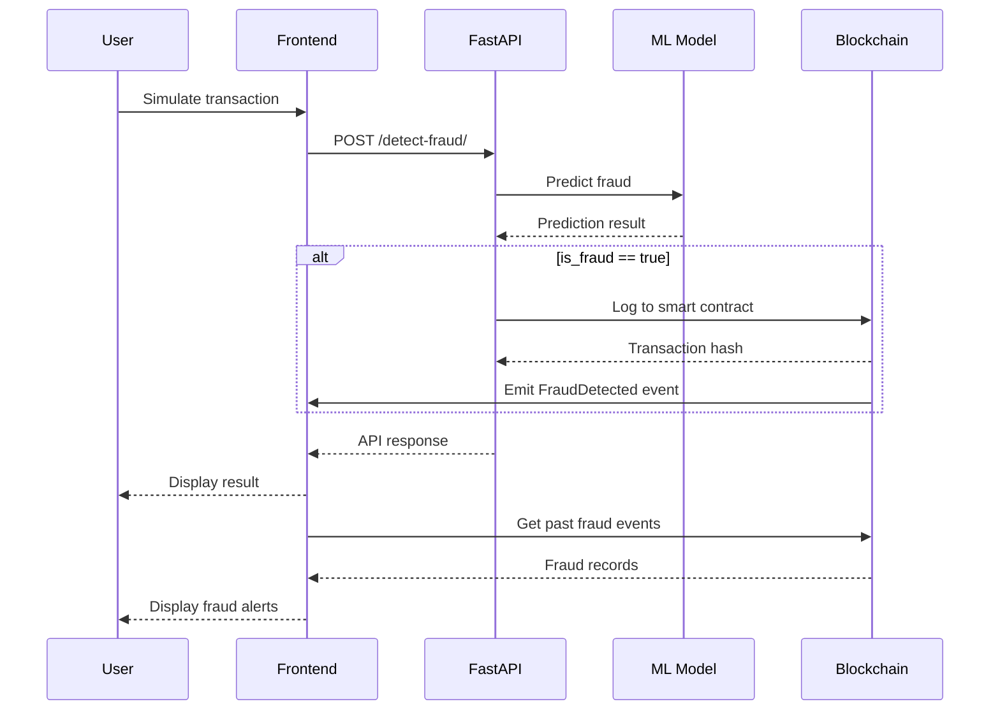

# Debit Card Fraud Detection System - Architecture

## System Process Flow

1. **Transaction Submission**:
   - A debit card transaction is submitted to the FastAPI backend
   - The transaction includes details like amount, merchant, category, etc.

2. **Fraud Detection**:
   - The FastAPI service validates the transaction data
   - A machine learning model predicts whether the transaction is fraudulent
   - The model returns a confidence score (0-100%)

3. **Blockchain Logging**:
   - If the transaction is predicted as fraud (confidence > 70%):
     - The FastAPI service logs the transaction to the Ethereum blockchain
     - A smart contract stores the fraud details and emits an event

4. **Frontend Display**:
   - The frontend application listens for `FraudDetected` events
   - When an event is detected, it's added to the fraud alerts list
   - The UI shows fraud statistics and allows viewing detailed information

5. **Transaction Simulation**:
   - Users can simulate transactions to test the system
   - The simulator sends transaction data to the API
   - Results are displayed in the UI in real-time

## Component Interaction

## API Endpoints

| Endpoint | Method | Description |
|----------|--------|-------------|
| `/detect-fraud/` | POST | Submit a transaction for fraud detection |
| `/merchants/` | GET | Get list of merchants for simulation |
| `/categories/` | GET | Get list of categories for simulation |
| `/jobs/` | GET | Get list of jobs for simulation |

## Smart Contract Functions

| Function | Description |
|----------|-------------|
| `logFraud(transactionHash, confidenceScore, metadata)` | Log a fraud transaction |
| `getFraudCount()` | Get total number of fraud records |
| `getFraudRecord(index)` | Get a specific fraud record by index |

## Frontend Components

| Component | Description |
|-----------|-------------|
| Connection Status | Shows blockchain connection state |
| Fraud Statistics | Displays fraud metrics (count, high risk, last detection) |
| Fraud Alerts | Lists detected fraud transactions |
| Simulator | Allows creating test transactions |
| Details Modal | Shows transaction details when clicked |
